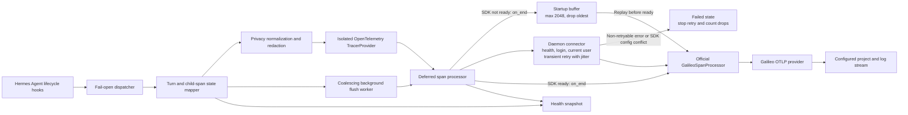
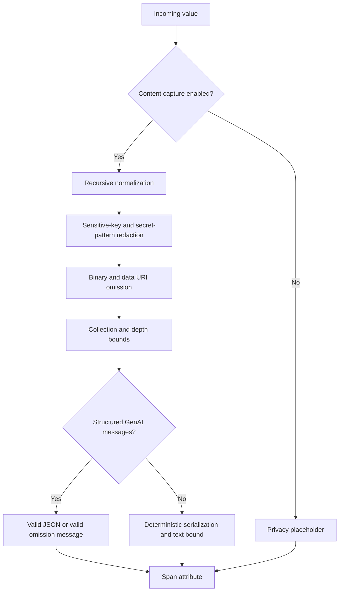

# Hermes Galileo連携設計

- 設計基準日：2026-07-24
- 対象：hermes-galileo 0.1系
- 関連文書：[調査](./RESEARCH.md)、[要件定義](./REQUIREMENTS.md)、[運用設計](./OPERATIONS.md)

## 設計の境界

現行設計は、Hermesの観測eventをOpenTelemetry spanへ変換し、Galileo公式SDKで直接exportする。
Galileo固有の認証、header生成、endpoint解決、batch exportは公式SDKへ委譲する。

現行実装が作るのはOpenTelemetry traceであり、Galileo native sessionをAPIで作成または終了する処理ではない。
会話のまとまりは、各root spanの`gen_ai.conversation.id`に同じHermes session IDを設定して表す。
Galileo native sessionのprovisioning、external ID設定、lifecycle管理は将来拡張とする。

## 現行アーキテクチャ



Hermes eventを受けるdispatcherは、callback引数を固定schemaへ強制しない。
既知のfieldだけをruntimeへ渡し、未知fieldは無視する。
runtimeで例外が発生してもcallbackから再送出せず、payloadをlogへ書かない。

installed packageは`hermes_agent.plugins` entry pointの`hermes_galileo = "hermes_galileo"`からmodule objectを公開する。
Hermesはそのmoduleの`register(context)`を呼び、hookを登録する。
entry pointを`hermes_galileo:register`へ向けるとload結果が関数になり、このmodule契約を満たさない。

状態mapperは、一回のユーザーターンとそのchild処理をthread-safeなin-memory stateとして保持する。
span属性を設定する前にprivacy変換を行い、加工済みの値だけをTracerProviderへ渡す。

TracerProviderはこの連携専用であり、resource、sampler、deferred processorを所有する。
外部からProviderとprocessorを注入した場合は、呼び出し元がlifecycleを所有する。

### Deferred SDK初期化

Galileo公式processorのconstructorは、health check、API key login、current user取得を行う。
現行実装はconstructorをdaemon threadで呼び、plugin登録とHermesのhook経路をnetwork待ちから分離する。

公式processorがreadyになる前に終了したspanは、deferred processorのmemory bufferへ入る。
buffer上限は2048 spanであり、満杯時は最古spanを一件捨てて`dropped_spans`を増やす。
接続後はbufferを取り出し、公式processorへ順番にreplayする。

SDK初期化に失敗した場合は、1秒、5秒、30秒、60秒の順で再試行する。
各間隔には0.8倍から1.2倍のjitterを加える。
5回目以降も60秒を基準にし、shutdownまたは接続成功まで続ける。
再試行対象はHTTP 408、429、500以上と、`ImportError`、`TypeError`、`ValueError`以外のstatusなしerrorである。
HTTP 408、429、500以上以外のstatus付きerror、`ImportError`、`TypeError`、`ValueError`、process globalなGalileo SDK singletonの設定競合は恒久errorとして`failed`へ遷移する。
恒久errorではretryを止め、保持中と以後に終了するspanをdropとして数える。
このretryはGalileo SDKの初期化retryであり、OTLP batchの送信retryとは別である。

process globalなGalileo SDK singletonが既にある場合は、API key、console URL、API URLを設定と比較する。
custom `GALILEO_CONSOLE_URL`を設定する場合は、既存singletonの有無にかかわらず、暗黙のAPI endpointを継承しないよう`GALILEO_API_URL`の明示pinを要求する。
processor構築後にも同じ検証を行い、構築中のsingleton差し替えまたはrouting変更を検出した場合はprocessorを閉じて`failed`にする。
設定でconsole URLまたはAPI URLを省略した場合は、initialize時に対応するstale environment値を除去する。

deferred processorは`connecting`、`replaying`、`ready`、`failed`、`stopping`、`stopped`の状態を持つ。
`exporter_ready`は公式processorのconstructorとstartup buffer replayが完了したことを表す。
個々のOTLP batchがGalileoへ受理されたことを表すdelivery acknowledgmentではない。
公式processorにはflush timeoutを秒へ変換したOTLP export HTTP timeoutを渡す。
ただし、processor構築前に`GalileoPythonConfig.get()`が行うhealth check、login、current user取得のbootstrap HTTP timeoutはこの設定で制御しない。
現行galileo-coreは各bootstrap requestで既定最大60秒待ち得るため、connector daemonはruntime shutdown後もconstructor内で継続する場合がある。
runtimeが`stopped`へ遷移した後もconstructor、startup replay、またはcleanupを行うconnector threadが生存している間は、`connector_cleanup_deferred=true`を公開する。

## Eventとspanの対応

現行実装の主な対応は次のとおりである。

| Hermes event | 状態遷移 | OpenTelemetry上の結果 |
| --- | --- | --- |
| session start | session metadataを記録 | spanは開始しない |
| pre LLM call | turnを開始 | root Agent spanを開始 |
| post LLM call | turn outputを記録 | rootへoutputとresponse modelを追加 |
| pre API request | API childを開始 | LLM `CLIENT` spanを開始 |
| post API request | API childを終了 | response、finish reason、token、durationを追加 |
| API request error | API childをerror終了 | `ERROR`、`error.type`、HTTP status、retry metadataを追加 |
| pre tool call | tool childを開始 | Tool `INTERNAL` spanを開始 |
| post tool call | tool childを終了 | result、status、durationを追加 |
| pre approval request | turnとtoolを解決してapproval childを開始 | Approval `INTERNAL` spanを対応toolのchildとして開始し、toolがなければrootのchildにする |
| post approval response | approval childを終了 | choiceとdeciderを追加 |
| subagent start | delegationを開始 | Agent `INTERNAL` spanを開始 |
| subagent stop | delegationを終了 | summary、status、durationを追加 |
| session end | active turnを終了 | root summaryとfinal statusを追加 |
| session finalizeまたはreset | active turnを終了 | lifecycle理由を付けてrootを終了 |

session startがGalileo native sessionを作らない点に注意が必要である。
session IDは、同じ会話に属する複数traceを`gen_ai.conversation.id`でgroupingするために使う。

### 推奨span階層

```text
invoke_agent Hermes Agent                       [INTERNAL, root per turn]
├── chat {model}                                [CLIENT]
├── execute_tool {tool_name}                    [INTERNAL]
│   └── approval_request                        [INTERNAL]
└── invoke_agent {subagent_role}                [INTERNAL]
    └── invoke_agent Hermes Agent               [INTERNAL, child session turn]
        ├── chat {model}                        [CLIENT]
        └── execute_tool {tool_name}             [INTERNAL]
```

root spanは、一意な論理API request ID数、tool call数、tool名、error数、final status、turn durationを要約する。
この要約により、各childを集計しなくても一回のターンの形を確認できる。

## 相関IDと親子関係

相関は、明示IDを優先し、欠落時だけbest-effort fallbackを使う。

| 対象 | 優先するID | fallback | 制約 |
| --- | --- | --- | --- |
| 会話 | `session_id` | `task_id`またはthread ID | fallbackはGalileo native sessionではない |
| ターン | `turn_id` | session内のactive turn | 同一sessionの同時turnを識別できない場合がある |
| API要求 | `api_request_id` | task IDとcall count | call count欠落時の一意性は保証しない |
| tool call | `tool_call_id` | task IDとtool名 | 同名toolの並行実行で衝突し得る |
| approval | `tool_call_id` | session key、pattern key、commandの組み合わせ | turnは`turn_id`、taskまたは唯一のactive turnから別に解決する |
| subagent | `child_session_id` | fallbackなし | ID欠落時はspanを開始しない |

Hermesがstable IDを供給した場合、runtimeはその値をidentityとして保持する。
retry時は同じ論理API要求のIDを維持し、各試行を別spanにする。
各試行へ1始まりの`hermes.api.attempt`を設定し、rootのAPI call数は試行数ではなく一意な論理要求数を数える。

session IDを持つeventでは、sessionをhard boundaryとして、明示turnまたはそのsessionのactive turnだけを探索する。
session IDがないapprovalなどでは、一意なturn ID、一意なtask ID、相関fieldを一つも持たない場合の唯一のactive turnの順で探索する。
候補が複数なら無関係なturnへ接続しない。

## 状態機械と並行性

turn、child span、subagent delegationは、再入可能lockで保護した辞書に保持する。
一つのcallback内で、期限切れstateの回収、対象stateの探索、span更新を直列化する。

同時turnの上限は512件である。
上限に達すると、最終更新時刻が最も古いturnを`state_capacity_exceeded`として終了する。
この処理はturn stateのmemory上限を作る。
これとは別に、deferred processorがSDK接続前の終了spanを2048件まで保持する。

turnのTTLは既定900秒であり、30秒から86400秒の範囲で設定できる。
TTL sweepはhookを受信した時に実行される。
processが完全にidleの場合は、次のhookまたはshutdownまで期限切れstateが残る。

同じchildの開始を重複して受けた場合、先に開いていたspanを`duplicate_start`として閉じる。
turn終了時に開いたままのchildは`abandoned`、subagentは`abandoned_subagent`として閉じる。
開始eventが欠けた終了eventでは、`hermes.span.synthesized=true`のspanを補完する。

## OpenTelemetry Provider

専用Providerには、次のresource属性を設定する。

- `service.name`
- `service.version`
- `deployment.environment.name`
- `telemetry.sdk.language=python`
- `hermes.plugin.name=hermes-galileo`

samplerは`ParentBased(TraceIdRatioBased(sample_rate))`である。
root traceには設定ratioを使い、親contextがある場合は親のsampling decisionを継承する。

span開始時には空のOpenTelemetry Contextへ明示したparentを設定する。
この方法は、並行するHermes turnがambient contextを介して誤接続されることを避ける。
一方、remote processとのW3C Trace Context伝播は現行範囲に含まれない。

## 属性設計

### Agent span

root Agent spanには、次の属性群を設定する。

- `gen_ai.operation.name=invoke_agent`
- `gen_ai.provider.name`
- `gen_ai.agent.name`
- `gen_ai.request.model`
- `gen_ai.conversation.id`
- `gen_ai.input.messages`
- `gen_ai.output.messages`
- OpenInference互換の`input.value`と`output.value`および`text/plain` MIME type
- Hermes session、turn、task、platform、schema version

Hermes session IDは現行のconversation groupingに使う。
session ID自体が個人情報を含む環境では、upstreamでopaque IDを発行するか、将来のsession ID仮名化を有効にする必要がある。
canonicalな`pre_llm_call`にproviderがなく、後続API eventにproviderがある場合は、root Agent spanもそのproviderで補完する。
subagent delegation spanには、operation、`provider=hermes`、agent名、inputとoutput、親子session ID、roleを設定する。
現行のsubagent delegation spanは`input.mime_type`と`output.mime_type`を設定しない。

### LLM span

LLM spanには、operation、provider、request model、response model、finish reason、request parameters、usageを設定する。
request時点でmodelとproviderを設定するため、head samplingの判断にも利用できる。

会話履歴取得が有効なcanonical requestでは`request.body.messages`を、canonical responseでは`assistant_message`をstructured GenAI messagesへ抽出する。
会話履歴取得が無効なら、request全体ではなく現在の`user_message`だけをinputへ使う。
上限を超えるstructured messagesは、有効なJSONの省略messageへ置き換える。
`input.value`と`output.value`はprivacy変換後のtextであり、MIME typeを`text/plain`にする。
pre API eventが欠けてpost eventだけから補完するsynthesized LLM spanも、content policyを通した`[request start event missing]`、`input.mime_type=text/plain`、OpenInference LLM kindを持つ。

usageは、Hermesのaggregate `prompt_tokens`をinputへ設定し、output、total、cache read、cache creation、reasoningを整数へ正規化する。
明示されたzero tokenも欠落させず属性へ保持する。
cache属性はaggregate inputの内訳であり、totalへ再加算しない。
互換性のためにOpenInferenceのtoken count属性も並記する。
providerが返す`cost`は独自属性として保存するが、Galileoのcost計算はmodel pricingとtoken数を正とする。
通貨と算定元を持たないcostは、請求額として扱わない。

### Tool span

Tool spanには、`execute_tool`、tool名、tool call ID、arguments、result、duration、outcomeを設定する。
argumentsとresultはcontent policyを通した文字列であり、生のPython objectを属性へ渡さない。
OpenInference互換のvalueには`text/plain` MIME typeを設定する。
pre Tool eventが欠けてpost eventだけから補完するsynthesized Tool spanも、post eventのargumentsから作るinput、`input.mime_type=text/plain`、OpenInference Tool kindを持つ。

toolの非成功statusはterminal errorとして扱う。
errorの分類には、API error、parameter error、timeout、permission errorなどの低cardinality値を使い、result本文を`error.type`に使わない。

### Approval span

Approval spanはGenAI規約の専用種別ではないため、Hermes namespaceを使う内部spanである。
commandはcontent policyの対象とし、pattern、surface、choice、deciderをmetadataとして記録する。
session IDがないGateway approvalは、一意なturn IDでrootへ相関する。
preとpostの両eventで`tool_call_id`をapproval identityとして最優先する。
tool call IDから開いているtool spanを解決できた場合、approvalをそのtool spanのchildにする。
同じcommandとpatternを持つapprovalが並行しても、異なるtool call IDでspanとresponseを分離する。

## Privacy処理

### 現行の処理順序



content取得は既定で無効である。
無効時もGalileoがinputとoutputのfieldを認識できるように、実内容の代わりに`[content capture disabled]`を送る。

有効時は、既知のsensitive keyとsecret形式を必ず秘匿する。
したがって、現行の有効状態は「無加工のfull capture」ではなく「redacted capture」である。
自由text中のPEM private key、`Cookie:`、`Set-Cookie:`も秘匿する。
generic JWT、AWS `AKIA`または`ASIA` access key、Google `AIza` key、空白を含むquoted passwordまたはsecret assignmentも自由textから秘匿する。
base64 data URIは、文字列全体と自由text途中のどちらでも省略する。
content取得と会話履歴取得を有効にした場合も、既知のreasoning、thinking、analysis、encrypted reasoning、`thought_signature`のmapping keyは値を`[REDACTED REASONING]`へ置換する。
`type`が`thinking`、`redacted_thinking`、`reasoning`などのreasoning blockでは、`type`を残し、`thinking`、`signature`、`data`を含むその他のfieldをすべて同じplaceholderへ置換する。

会話履歴には独立した設定を用意している。
履歴取得が無効な場合、root inputとLLM API inputは現在の`user_message`だけを使い、canonical provider requestの蓄積済み`body.messages`を送らない。
履歴取得が有効な場合だけ、canonical provider requestの`body.messages`をstructured inputへ変換する。

### 既知のprivacy制約

error messageは、content取得が無効ならstatus descriptionにもeventにも保存しない。
status descriptionにはerror messageとは別のbounded error typeだけを保存する。
content取得が有効なら、redactorを通したmessageをexception eventへ保存する。
Tool errorを含め、同じmessageをcustom属性へ重複保存しない。
`error.type`は100文字以下のbounded識別子へ正規化する。
現行実装は許可語彙を強制しないため、upstreamはerror classなどの低cardinality taxonomyを渡す必要がある。

user IDの既定仮名化は、専用pseudonym secretを優先し、未設定時はGalileo API keyを使うHMAC-SHA-256の短縮値である。
どちらのsecretもない状態で仮名化関数を直接使う場合だけ、SHA-256へfallbackする。
専用secretを設定し、key versionとrotation期間をまたぐ相関方針を運用で管理することが目標設計になる。
HMACであっても仮名化であり、匿名化とは扱わない。
API keyとpseudonym secretは`Settings` dataclassの`repr`対象から外し、設定objectを誤ってlogへ出しても値を含めない。

文字数上限は、serialization後の文字列へ適用する。
`gen_ai.input.messages`と`gen_ai.output.messages`は上限超過時も有効なJSONを保つ。
tool argumentsとtool resultはbounded textとして扱うため、長大なJSON値の構造保持までは保証しない。

mappingとsequenceは`len`で要素数を取得し、`islice`で設定上限までだけをiterateする。
上限を超えた件数は省略表現へ記録し、巨大なcustom sequenceでも上限件数を超えて読み進めない。

## Errorと終了状態

現行実装は、terminal errorへ100文字以下に正規化した`error.type`と`ERROR` statusを設定する。
status descriptionにも同じbounded error typeだけを設定する。
content取得が有効でerror messageがある場合だけ、秘匿済みexception eventを一件追加する。
Tool errorも同じexception eventだけを使い、独自のerror message属性へ重複保存しない。
正常終了のstatusはOpenTelemetryの一般規約どおり未設定にする。

turnの終了理由は、次のように扱う。

| 終了理由 | error扱い | 説明 |
| --- | --- | --- |
| completed | いいえ | 通常完了 |
| interrupted | いいえ | operatorまたはAgentによる中断 |
| finalized | いいえ | session finalize |
| reset | いいえ | session reset |
| incomplete | はい | completedでもinterruptedでもない |
| superseded | はい | 同一sessionで前turn終了前に次turnを開始 |
| evicted | はい | state capacity超過 |
| timed_out | はい | state TTL超過 |
| shutdown | はい | process終了時に未完了 |

API error eventは対象の試行spanを`ERROR`で終了する。
同じ論理request IDを持つ次のpre eventは、新しい試行spanを開始して`hermes.api.attempt`を一つ増やす。
retry成功spanは未設定statusで終了し、先行する失敗試行とは同じ`hermes.api.request_id`で相関する。
この実event sequenceはintegration testで固定する。

## Flushとshutdown

turn終了時のflushはbackground threadへ要求する。
複数のturnが短時間に終了した場合、event flagによって要求をまとめる。
flush失敗はwarningへ記録し、Agentへ伝播しない。

shutdownはlockで保護したadmission gateを閉じ、以後のhookを拒否し、open turnを`shutdown`として閉じる。
packageの終了経路は共有runtimeをunpublishしてからdrainを始める。
flush timeoutは100ミリ秒から120000ミリ秒の範囲で設定する。

background flush workerはflush timeoutまで停止を待つ。
期限を超えた場合はProvider cleanupをdaemon threadへ延期し、flush完了後に一度だけ実行する。

公式processorがまだ`connecting`または`replaying`なら、deferred processorのshutdownは自身のflush-timeout deadlineまでreadyを待つ。
期限内にreadyになれば公式processorを一度shutdownし、期限切れまたは`failed`ならbufferをdrop数へ加算して破棄する。
delegateの`force_flush`と`shutdown`はoperation lockで直列化する。
delegate shutdownがdeadlineを超えた場合もdaemon threadで継続する。
停止状態への遷移、delegate取得、buffer破棄は同じlock内で行い、connectorとの競合を防ぐ。
通常の`force_flush`も指定timeoutまでreadyを待ち、残り時間でdelegateへqueue drainを要求する。
`force_flush`はoperation lock取得後にもready状態とdelegate identityを再検証し、shutdownが先に状態を変えた場合はdelegateを呼ばず`False`を返す。
`force_flush=True`はqueue drain要求の完了だけを示し、Galileoのdelivery acknowledgmentではない。
OTLP export HTTP timeoutにもflush timeoutを渡し、各cleanup段階はbounded waitまたはdaemon継続にする。
ただし、background flusherとProvider配下のdeferred processorは別々にflush timeoutを使うため、runtime shutdown全体を一つのtimeoutに収める保証はない。
外部注入Providerの`force_flush`がtimeoutを無視する場合も同期呼び出しが残る。

このworkerはturn-end flush要求をまとめるものであり、永続queueではない。
process crash時の未送信spanを復元する保証はない。

## Health情報

現行のprogrammatic health snapshotは、次の情報を返す。

- runtimeがshutdownしていないか
- project名とlog stream名
- content取得状態
- sample rate
- in-flight turn、child span、subagent数
- 開始および終了したturnとspanの累計
- orphaned span数
- `exporter_ready`
- `exporter_state`
- `buffered_spans`
- `dropped_spans`
- `connection_attempts`
- `last_connection_error_type`
- `last_connection_error_retryable`
- `retry_stopped_reason`
- `connector_cleanup_deferred`
- `provider_cleanup_deferred`
- `delegate_cleanup_deferred`

API keyは返さない。
`dropped_spans`はstartup bufferのoverflow、replay失敗、恒久初期化失敗、failed、stopping、stopped状態で終了したspan、shutdown期限切れを数える。
ready後のdelegate enqueue失敗、Galileoへの最終送信成功、SDK内部queue量、partial rejection、export latencyは含まない。
`provider_cleanup_deferred`は、background flusherがruntimeのdeadlineを超え、Provider cleanupがdaemonへ延期されたことを示す。
`delegate_cleanup_deferred`はdelegate cleanup threadの実行中を示し、shutdown返却後も`true`ならdeferred processorのdeadlineを超えて継続している。
`connector_cleanup_deferred`は、runtimeが`stopped`でもconnector threadがconstructor、startup replay、またはその後のcleanup内で継続していることを示し、thread終了後に`false`へ戻る。
host processがHTTP health endpointを提供する場合は、このsnapshotをprocess状態の一部として使い、exporter状態を別metricで補う。

## OTLP transportの現行制約

現行依存関係で確認したOpenTelemetry Python 1.44.0のOTLP HTTP exporterは、connection error、HTTP 408、HTTP 500から599だけを再試行対象にする。
HTTP 429は再試行対象ではなく、`Retry-After` headerも利用しない。
また、HTTP 2xxではresponse bodyを解析せず即座に成功を返すため、HTTP 200の`partialSuccess`に含まれるrejected span数とmessageをruntimeから取得できない。

したがって、起動時のSDK接続retryとstartup bufferが実装済みでも、REL-007の429および`Retry-After`対応とREL-008のpartial success観測は未充足である。
これらを必須にする場合は、公式SDKの更新確認、processorまたはexporter wrapper、もしくはCollector profileを設計する。
根拠は、[OpenTelemetry Python 1.44.0 OTLP HTTP trace exporter](https://github.com/open-telemetry/opentelemetry-python/blob/v1.44.0/exporter/opentelemetry-exporter-otlp-proto-http/src/opentelemetry/exporter/otlp/proto/http/trace_exporter/__init__.py)と[同versionのHTTP retry判定](https://github.com/open-telemetry/opentelemetry-python/blob/v1.44.0/exporter/opentelemetry-exporter-otlp-proto-http/src/opentelemetry/exporter/otlp/proto/http/_common/__init__.py)にある。

## 検証済みのexport境界

wire E2Eは、公式SDKが行うhealth check、API key login、current user取得と、OTLP protobuf送信までをfake Galileo serverで検証する。
通常時は、OTLP requestの認証header、resource、projectとlog stream、rootからLLMおよびToolへの親子関係、token mapping、会話履歴のOpt-In、privacy canaryを検査する。
failure matrixは、401、429、503、408、connection reset、read timeout、HTTP 200 partial success、large payloadを再現する。
503、408、connection resetのretryでは、trace ID、span ID、serialize済みrequest bodyが変わらないことを検査する。
429のno-retryとpartial successの非検出も、現行依存関係の既知gapとして固定する。
Approvalのturn相関、Tool配下の親子関係、同一commandとpatternを持つparallel approvalの交差しないresponse相関はintegration testで検証する。

このE2Eは公式SDKを含む送信wireを検証するが、実Galileoへ保存されたtraceのread-backまでは検証しない。
実Galileo上のrouting、表示、評価metric、重複、delivery latencyは外部環境に依存するlive受入として残る。

## 将来のGalileo native session

Galileo native session provisioningを導入する場合は、現行のconversation groupingから独立した設計変更として扱う。
少なくとも次の判断が必要になる。

- sessionを作成する時点と、作成失敗時のfail-open動作
- Hermes session IDとGalileo external IDの対応
- 複数processが同じHermes sessionを扱う場合の冪等性
- session終了、reset、retention、再開の意味
- session APIのretry、重複作成、credential scope
- content policyとsession metadata policyの統一

native session作成に失敗してもtrace exportを止めないことを基本方針とする。
導入時は、`gen_ai.conversation.id`によるgroupingとの二重管理をE2Eで検証する。

## ADR-001 公式GalileoSpanProcessor

- 状態：採用
- 決定日：2026-07-24
- 関連要件：INT-002、TEL-010、REL-002、REL-013

### 背景

Galileoは、credentialからOTLP header、endpoint、project、log stream、batch processorを構成する公式span processorを提供している。
独自exporterを実装すると、Galileo側の認証またはrouting変更へ追随する責任がこのプロジェクトへ移る。

### 決定

direct構成では、公式登録helperを使ってdeferred processorをProviderへ登録する。
deferred processorはdaemon threadで公式`GalileoSpanProcessor`を生成し、SDK接続前の終了spanを2048件まで保持する。
startup buffer replay完了後だけreadyを公開し、非retryable errorとSDK singleton設定競合ではretryを止める。
API key、project、log stream、custom console URL、custom API URLは公式環境変数で渡す。

### 影響

- Galileo固有protocolの保守をSDKへ委譲できる。
- Galileo SDKのversionと挙動が互換性境界になる。
- startup buffer量、startup drop、SDK接続状態、接続試行、直近接続error種別、retry可否、停止理由、deferred cleanupはhealthから観測できる。
- SDK内部queue、最終送信成功、OTLP retry、partial success情報は、現行runtimeだけでは観測できない。
- 現行OpenTelemetry Python 1.44.0では429と`Retry-After`が再試行対象にならず、2xx response bodyも公開されない。
- SDK更新時にwire-level testとlive E2Eが必要になる。

### 棄却した案

Galileo Loggerを直接呼ぶ案は、既存のOpenTelemetry traceと二重のlifecycle管理を生むため採用しない。
OTLP endpointとheaderを直接組み立てる案は、公式SDKを使うという要件と保守境界に反するため採用しない。

根拠は、[Galileo OpenTelemetry統合概要](https://docs.galileo.ai/sdk-api/third-party-integrations/opentelemetry-and-openinference)にある。

## ADR-002 content取得のOpt-In

- 状態：採用
- 決定日：2026-07-24
- 関連要件：PRI-001からPRI-010

### 背景

GalileoはAgent、LLM、Tool spanのinputとoutputを有効性判定に使う。
OpenTelemetryは、それらを機微かつ大きな値としてOpt-Inに分類している。

### 決定

既定では実contentを取得せず、型を保ったprivacy placeholderをinputとoutputへ設定する。
operatorがcontent取得を明示した場合だけ、再帰的な秘匿と上限を適用した値を送る。
既知secretを無加工で送るfull modeは提供しない。
会話履歴は別の明示設定で制御する。

### 影響

- 既定設定でprompt、response、tool payloadの漏えい面を縮小できる。
- contentを使うGalileo評価は、placeholder状態では利用できないか、精度が低下する可能性がある。
- redacted placeholderとredacted contentがGalileoのminimum valid spanとして扱われることをlive E2Eで確認する必要がある。
- error情報、session metadata、resource属性も同じprivacy境界へ含めなければならない。

### 棄却した案

本番を含めて常時full captureする案は、データ最小化とOpenTelemetryのOpt-In要件に反するため採用しない。
Galileo到着後だけredactする案は、SDK queueと通信経路に生データが残るため採用しない。

根拠は、[OpenTelemetry GenAI spans](https://github.com/open-telemetry/semantic-conventions-genai/blob/main/docs/gen-ai/gen-ai-spans.md)と[OpenTelemetry Sensitive Data](https://opentelemetry.io/docs/security/handling-sensitive-data/)にある。

## ADR-003 direct SDKとCollectorの境界

- 状態：採用
- 決定日：2026-07-24
- 関連要件：REL-007からREL-012、OPS-004

### 背景

direct SDKは構成が少なく、HermesとGalileoの専用連携に適している。
一方、tail sampling、永続WAL、集中redaction、詳細なqueue metricはCollectorの責務に適している。

### 決定

現行と既定のproduction topologyはdirect SDKとする。
次の条件のいずれかが必須になった環境では、Collector topologyを別deployment profileとして導入する。

| 条件 | direct SDK | Collectorを検討する基準 |
| --- | --- | --- |
| traffic量 | 2048件のstartup buffer内で接続し、接続後のSDK queue制約を許容する | 継続的なstartup drop、または接続後queueのSLOが必要 |
| sampling | head samplingで足りる | error、latency、costによるtail samplingが必要 |
| crash耐久 | process終了時flushで足りる | crash後の未送信span復元が必要 |
| policy | process内redactionで足りる | 複数serviceへ共通policyを強制する |
| self-observability | SDK接続状態、startup buffer、startup dropで足りる | partial rejection、downstream queue age、retry、最終送信成功を計測する |
| OTLP応答 | 408と5xxの現行retryで足りる | 429、`Retry-After`、partial successを仕様どおり扱う |
| routing | 一つのGalileo送信先 | 複数tenantまたは複数destinationを中央管理する |

Collector profileでは、applicationから標準OTLP exporterでlocal Collectorへ送り、CollectorがGalileoのOTLP endpointと認証headerを所有する。
このprofileは公式GalileoSpanProcessorを経由しないため、導入前に別ADR、credential管理、Galileoとのwire contract testが必要になる。

### 影響

- 通常環境は公式SDKだけで運用できる。
- Collectorは常時必須ではないため、deploymentと障害点を増やさない。
- directとCollectorでexport pathが異なるため、同じspan contract suiteを両方へ適用する必要がある。
- Collectorへ移行しても、Hermes eventからspanへのmappingとprocess内privacy最小化は維持する。

### 棄却した案

全環境へ最初からCollectorを必須にする案は、小規模利用にも別processと設定管理を要求するため採用しない。
startup bufferの観測だけでend-to-endの配送SLOまで充足したとみなす案は、接続後のSDK queueとGalileo受理を検証できないため採用しない。

Collectorの耐久性は、[OpenTelemetry Collector Resiliency](https://opentelemetry.io/docs/collector/resiliency/)を基準にする。

## 設計上の未解決事項

次の事項は実装済み動作ではなく、受入前の変更または検証対象である。

1. pseudonym secretのkey versionとrotation期間をまたぐ相関方針を追加する。
2. tool argumentsとtool resultにも、必要なら切り詰め後の有効なJSON構造を保証する。
3. Galileo processorのdownstream queue、最終送信成功、export latencyを観測する。
4. HTTP 429と`Retry-After`の再試行、およびHTTP 200 partial successの検出を実装する。
5. ready後のdelegate enqueue失敗をdrop metricへ反映する。
6. `error.type`を許可語彙へ制限し、低cardinalityを実装で強制する。
7. Hermesとstable API request IDおよびtool call IDの契約を固定する。
8. native Galileo session provisioningの要否とlifecycleを決める。
9. GenAI Semantic Conventionsのversion pinとmigration testを明示する。
10. 実Galileoへの送信後read-backを外部環境で検証する。
11. process強制終了時にも期限後daemon cleanupを完了させる必要がある環境では、外部spoolまたはCollectorを導入する。
